# NE301 v2.3.0 OTA 更新指南

> [English](./NE301_v2.3.0_OTA_Update_Guide.md) | **中文**

> **适用场景**: 从 NE301 v2.1.0 (commit `0198d97` 及之前版本) 升级至 v2.3.0
>
> **前置条件**: 设备正常运行旧版本固件，PC 端已准备好所有 OTA 固件文件
>
> ⚠️ **重要警告**: 由于 v2.3.0 的 Flash 分区表做了重新设计——Web 分区为**全新独立分区**（旧版无此分区），升级必须严格按照本文档的**步骤和顺序**执行。跳过任何步骤或打乱顺序将导致设备 Web 界面无法访问。

---

## 目录

1. [升级概述](#升级概述)
2. [准备工作](#准备工作)
3. [步骤一：上传新版本 APP 固件](#步骤一上传新版本-app-固件)
4. [步骤二：Web 固件恢复](#步骤二web-固件恢复)
5. [步骤三：上传新版本 Web OTA 固件](#步骤三上传新版本-web-ota-固件)
6. [步骤四：FSBL 固件升级](#步骤四fsbl-固件升级)
7. [步骤五：WiFi 固件升级](#步骤五wifi-固件升级)
8. [步骤六：验证升级结果](#步骤六验证升级结果)
9. [常见问题](#常见问题)

---

## 升级概述

v2.3.0 将原来混杂在其他分区中的 Web 资源独立为一个 Flash 分区 (`WEB_BASE = 0x71900000`)。升级后旧 Web 资源不再可用，设备将自动进入内置的 Web Recovery 恢复模式。升级需要按以下顺序完成：

```
旧版本 v2.1.0
    │
    ├── 1. 上传新 APP 固件 → 设备重启 → APP 升级完成（新分区表生效）
    │
    ├── 2. 连接设备 WiFi → 打开浏览器 → 进入 Web Recovery 模式
    │     （原因：Web 分区地址变更，旧 Web 资源不再可访问）
    │
    ├── 3. 在 Recovery 页面 → 上传新 Web OTA 固件 → 页面自动恢复
    │     （Web 上传完成后自动重载 assets，无需重启）
    │
    ├── 4. 进入正常界面 → 系统提示 FSBL 版本不匹配 → 跟随引导升级
    │     （如无提示：系统设置 → 固件升级 → 导入固件 → 高级选项 → FSBL 升级）
    │
    ├── 5. 重新连接 WiFi → 系统提示 WiFi 版本不匹配 → 跟随引导升级
    │     （如无提示：系统设置 → 固件升级 → 导入固件 → 高级选项 → WiFi 升级）
    │     ⏳ WiFi 固件推送至芯片约需 1-3 分钟，请耐心等待
    │
    └── 6. 升级完成 → 验证版本信息
```

### 为什么需要这样的流程？

| 变更点                         | 影响                                                   |
|-------------------------------|-------------------------------------------------------|
| Web 分区独立 (0x71900000)       | 旧版 APP 没有此分区概念，APP 升级后 Web 资源丢失 → 触发 Recovery |
| FSBL 期望版本校验 (1.0.3.0)     | APP 编译时指定 `EXPECTED_FSBL_VERSION=1.0.3.0`，不匹配则提示 |
| WiFi 分区地址变更 + SDK 升级     | APP 编译时指定 `EXPECTED_WIFI_VERSION=2.15.5.2`，不匹配则提示 |

---

## 准备工作

### 需要准备的 OTA 固件文件

| 文件名                              | 类型   | 说明                  |
|------------------------------------|-------|----------------------|
| `ne301_App_signed_v2.3.0.133_pkg.bin`   | APP   | 主应用程序 OTA 包       |
| `ne301_Web_v1.5.0.0_pkg.bin`            | Web   | Web 前端资源 OTA 包     |
| `ne301_FSBL_signed_v1.0.3.0_pkg.bin`    | FSBL  | 第一阶段引导程序 OTA 包   |
| `ne301_Wifi_flash_v2.15.5.2_pkg.bin`    | WiFi  | SiWG917 无线固件 OTA 包 |

### 操作环境

- 一台可以连接设备 WiFi 热点的 PC / 手机
- 推荐 Chrome / Edge 浏览器（遇到缓存问题可使用无痕模式）

---

## 步骤一：上传新版本 APP 固件

> **目标**: 将 v2.3.0 APP 固件写入 Flash，重启后新分区表和新功能生效。

### 操作步骤

1. 确保设备正常运行旧版本固件，PC 已连接设备 WiFi 热点
2. 浏览器访问设备 Web 管理界面
3. 导航至 **系统设置** → **固件升级** → 点击 **导入固件**

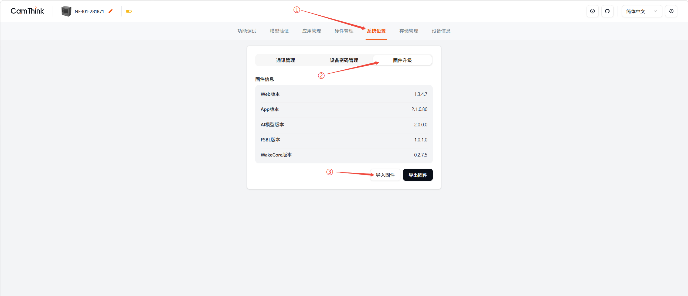

4. 在弹出的导入固件对话框中，点击 **APP 文件** 区域选择文件

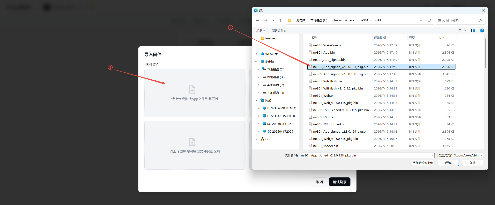

5. 选择 `ne301_App_signed_v2.3.0.133_pkg.bin` 文件
6. 等待上传完成（上传过程中页面会显示进度）
7. 点击 **确认烧录** 按钮

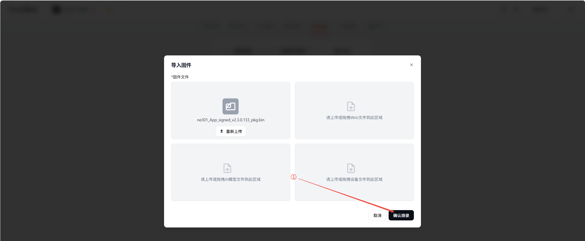

8. 设备将自动重启，显示等待画面

### 预期结果

- 设备自动重启
- 等待约 5-15 秒后重新搜索设备 WiFi 热点

---

## 步骤二：Web 固件恢复

> **目标**: 进入 Web Recovery 模式，为上传新版本 Web 固件做准备。

### 操作步骤

1. PC 重新连接设备 WiFi 热点
2. 打开浏览器，输入设备管理地址（或刷新之前的页面）

3. 预期将看到 **Web Recovery Mode** 恢复界面：

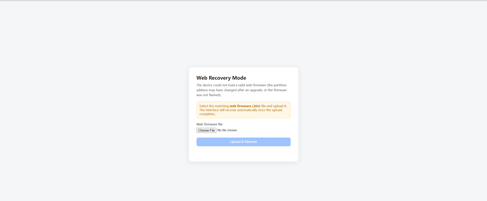

> 界面显示: "The device could not load a valid web firmware (the partition address may have changed after an upgrade, or the firmware was not flashed)."

4. **如果未进入恢复界面**，尝试：
   - 打开新的浏览器标签页（推荐使用无痕/隐私模式）
   - 清除浏览器缓存后刷新（Ctrl+Shift+Del）
   - 换用其他浏览器（Chrome → Edge → Firefox）

---

## 步骤三：上传新版本 Web OTA 固件

> **目标**: 在 Recovery 模式下上传新版 Web 固件，恢复正常 Web UI。

### 操作步骤

1. 在 Web Recovery 界面，点击文件选择区域
2. 选择 `ne301_Web_v1.5.0.0_pkg.bin` 文件

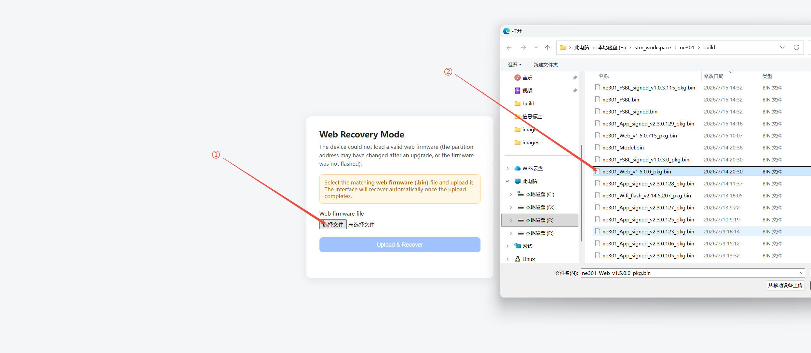

3. 点击 **Upload & Recover** 按钮
4. 进度条将实时显示上传进度

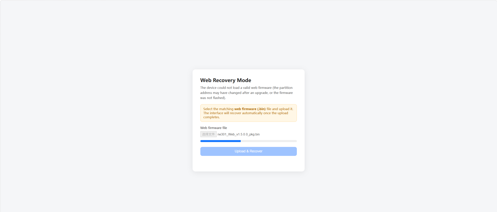

5. 上传成功后，页面显示 "Recovery successful, reloading interface..."，约 1.5 秒后**自动刷新**进入正常的 Web 管理界面

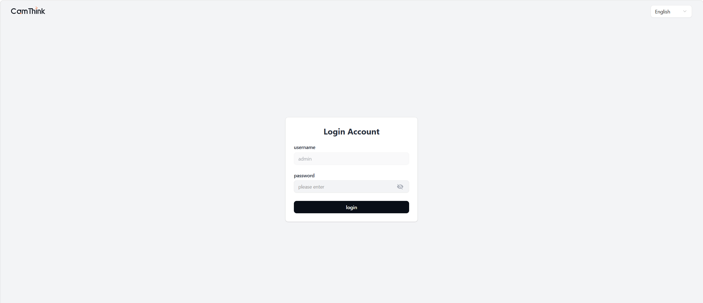

6. **如果页面未自动刷新**：手动刷新浏览器页面（F5）

### 预期结果

- 正常进入设备 Web 管理界面
- 可以看到完整的功能菜单

---

## 步骤四：FSBL 固件升级

> **目标**: 更新 FSBL 至 `1.0.3.0`，消除版本不匹配警告。

### 自动提醒方式

1. 进入 Web 管理界面，导航至 **系统设置** → **固件升级**

2. 在固件信息列表中检查 **FSBL 版本**——如果当前版本与编译期望版本 (`1.0.3.0`) 不一致，右侧会出现 **提示图标**：

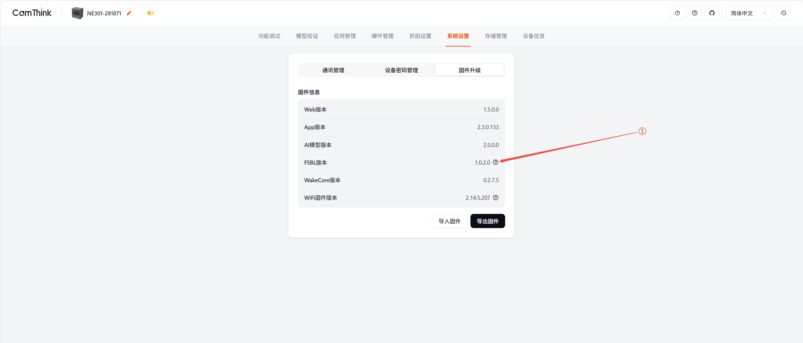

3. 点击图标弹出对话框，展示当前版本与期望版本：

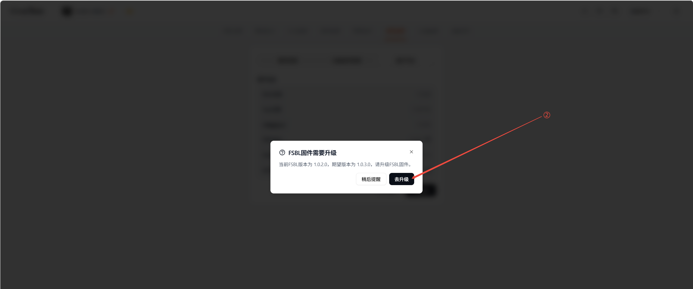

4. 点击 **立即升级**，跳转至 FSBL 升级页面

### 手动进入方式

如果没有自动提示，手动进入：**系统设置** → **固件升级** → **导入固件** → 左下角 **高级选项** → **FSBL 固件升级**

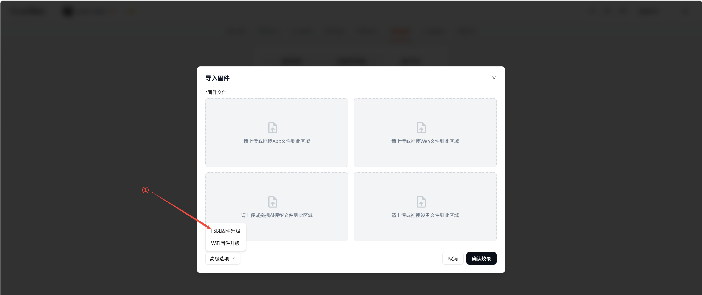

### 上传并完成升级

1. 在 FSBL 升级页面，点击文件选择区域
2. 选择 `ne301_FSBL_signed_v1.0.3.0_pkg.bin` 文件

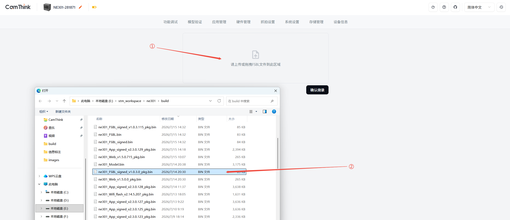

3. 点击 **确认烧录**，设备重启完成 FSBL 升级

> ⚠️ **注意**: 点击 **确认烧录** 后页面可能会无反应，但实际上设备已经在后台完成了 FSBL 升级并开始重启。请等待约 5-10 秒后重新连接设备 WiFi，进入 **系统设置 → 固件升级** 确认 FSBL 版本已更新。

### 预期结果

- 设备重启后重新连接 WiFi 进入 Web → 系统设置 → 固件升级 → FSBL 版本显示 `1.0.3.0`（提示消失）

---

## 步骤五：WiFi 固件升级

> **目标**: 更新 SiWG917 无线芯片固件至 `2.15.5.2`（SDK v4.0.2 配套）。

⚠️ **注意**: WiFi 固件推送至 SiWG917 芯片内部存储约需 **1-3 分钟**，这是整个流程中耗时最长的步骤。请耐心等待，**切勿中途断电**。

### 自动提醒方式

1. PC 重新连接设备 WiFi，进入 Web 管理界面 → **系统设置** → **固件升级**

2. 检查 **WiFi 版本** 一栏：
   - **Flash 版本** ≠ **运行版本**：出现提示图标
   - 二者一致但 ≠ **期望版本** (`2.15.5.2`)：出现提示图标

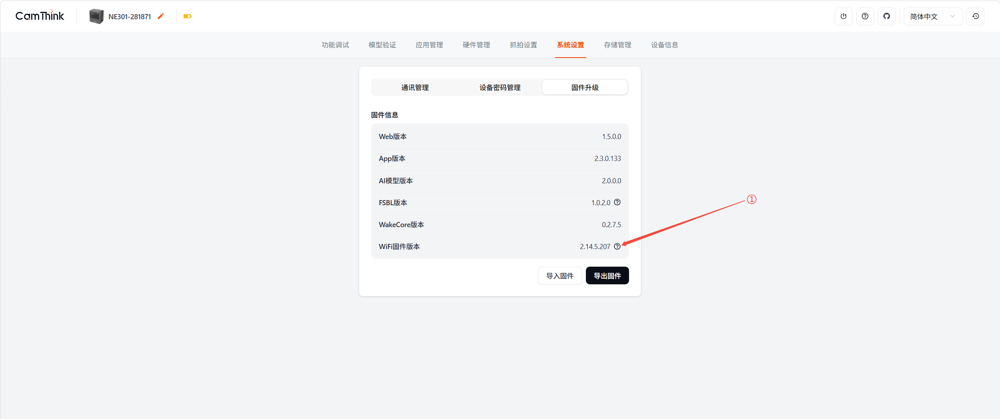

3. 点击提示图标 → **立即升级**

### 手动进入方式

**系统设置** → **固件升级** → **导入固件** → **高级选项** → **WiFi 固件升级**

### 操作步骤

1. 在 WiFi 升级页面，点击文件选择区域
2. 选择 `ne301_Wifi_flash_v2.15.5.2_pkg.bin` 文件

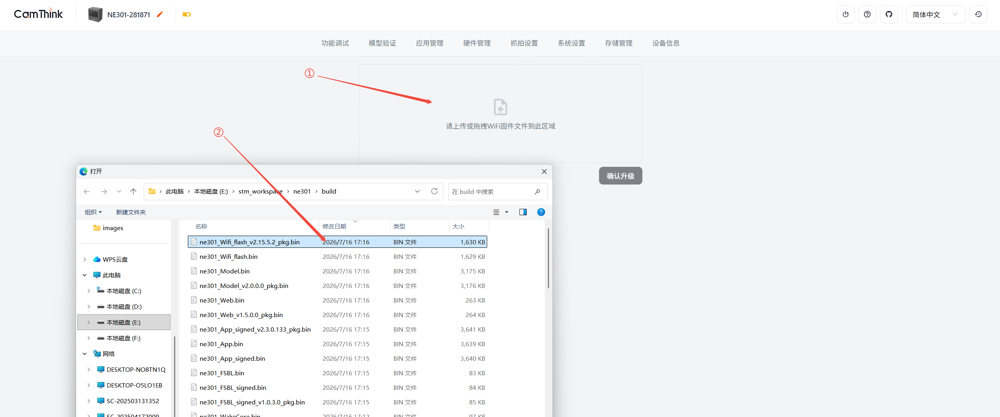

3. 文件上传完成后点击 **确认升级**
4. 弹出二次确认，确认后点击 **确认**

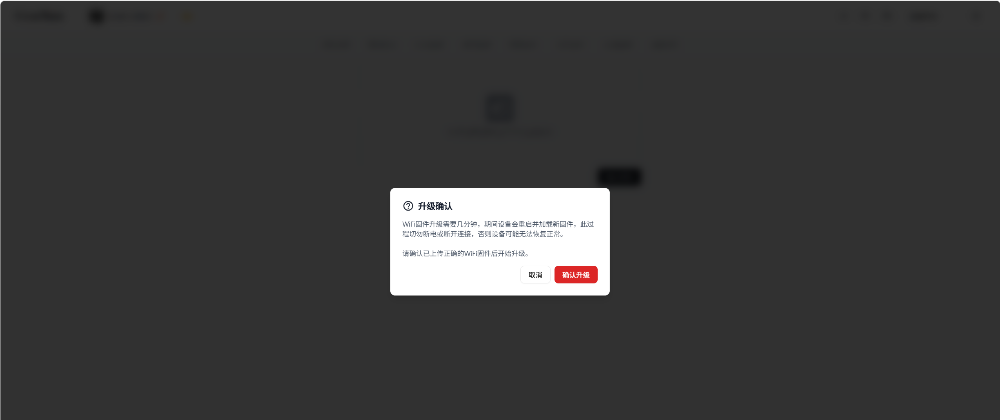

5. 设备重启并开始 WiFi 固件推送

### 等待升级完成

设备重启后的行为：
- LED **快速闪烁**（WiFi 固件正在推送至 SiWG917 芯片）
- WiFi 热点会被断开，需要等更新完成后再次手动连接
- PC 端前端轮询（每 5 秒，最长 60 秒）检测设备是否恢复

如果前端未能检测到设备恢复，页面跳转至 **LED 指引等待页** (`/upgrade-waiting`)：

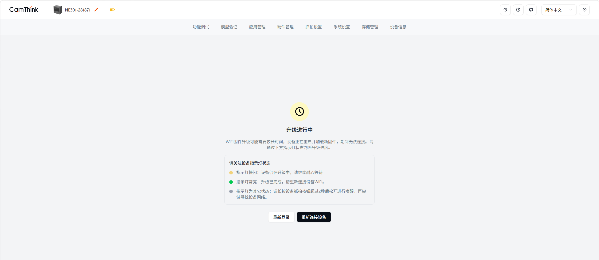

根据 LED 状态判断：
- **LED 常亮** → 升级完成
- **LED 闪烁** → 升级进行中
- **LED 熄灭** → 异常或进入休眠了，尝试长按2S以上按钮唤醒

### 预期结果

- 固件升级页 WiFi 版本显示 `2.15.5.2`（Flash、运行版本一致）

---

## 步骤六：验证升级结果

1. 进入 **系统设置** → **固件升级**
2. 确认以下版本信息：

| 组件         | 期望版本     | 状态指标    |
|-------------|------------|-----------|
| APP 版本     | 2.3.0.x    | ✓         |
| Web 版本     | 1.5.0.0    | ✓         |
| FSBL 版本    | 1.0.3.0    | ✓ 无提示图标 |
| WiFi 版本    | 2.15.5.2   | ✓ 无提示图标 |
| AI 模型版本  | 2.0.0.0    | ✓         |
| WakeCore     | 0.2.7.5    | ✓         |

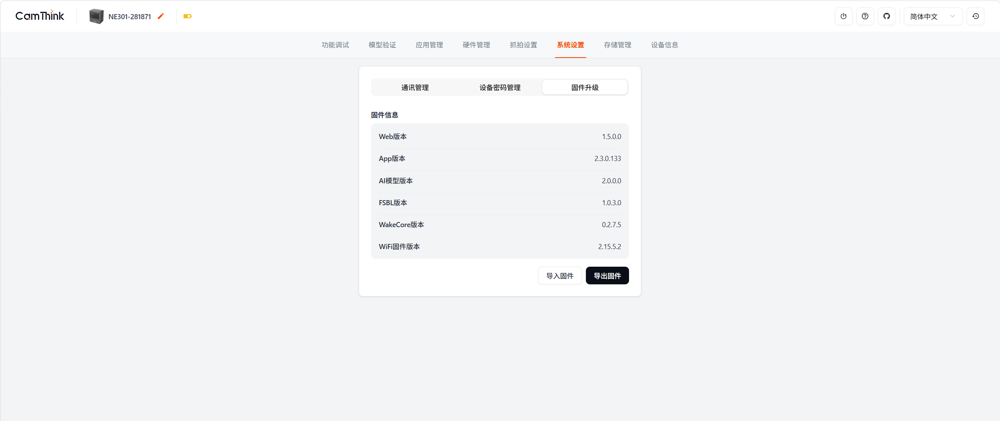

3. 所有版本正确且无警告图标 → OTA 升级完成。

---

## 常见问题

### Q: 升级过程中断电了怎么办？

- **APP 升级断电**: A/B 分区保护机制——旧槽位固件完好，重新上电后自动启动。新槽位标记为 `UNBOOTABLE` 后系统自动回退
- **FSBL 升级断电**: FSBL 损坏将导致设备无法启动，需通过 JTAG/SWD 重新烧录
- **WiFi 升级断电**: 如果断电时正在推送 `.rps` 至芯片，重新上电后 WiFi 可能功能异常，可重新进入 WiFi 升级页面再次上传更新

### Q: Web Recovery 页面没有出现怎么办？

- 浏览器开无痕/隐私模式，重新输入设备 IP
- 清除浏览器缓存
- 换其他浏览器
- 确认 PC 已连接设备 WiFi 热点

### Q: FSBL / WiFi 升级提示没有出现？

手动路径：
- **FSBL**: 系统设置 → 固件升级 → 导入固件 → 高级选项 → FSBL 固件升级
- **WiFi**: 系统设置 → 固件升级 → 导入固件 → 高级选项 → WiFi 固件升级

### Q: WiFi 固件升级后设备连不上？

1. 等待至少 3 分钟，观察设备 LED
2. LED 常亮但搜不到热点 → 尝试重启设备
3. 仍未恢复 → 通过 JTAG/SWD 烧录完整固件包

### Q: 旧版 WiFi 固件还能用吗？可以不升级 WiFi 吗？

**可以继续使用**。旧版 WiFi 固件（如 `2.14.5.x`）与新 SDK v4.0.2 保持兼容。但系统会根据 `EXPECTED_WIFI_VERSION=2.15.5.2` 在校验页面显示提示图标，**建议**升级以获取最新改进。

### Q: 可以跳过 FSBL 升级吗？

**不建议**。APP v2.3.0 编译时指定 `EXPECTED_FSBL_VERSION=1.0.3.0`，不匹配时固件信息页持续显示警告。

---

## 版本信息

| 项目     | 信息                                                  |
|---------|-------------------------------------------------------|
| 文档版本  | 1.0.0                                                |
| 适用固件  | NE301 v2.3.0                                          |
| 上一版本  | v2.1.0 (commit `0198d97`)                             |
| 关联文档  | [NE301 v2.3.0 Change Log](./NE301_v2.3.0_ChangeLog_cn.md) |
