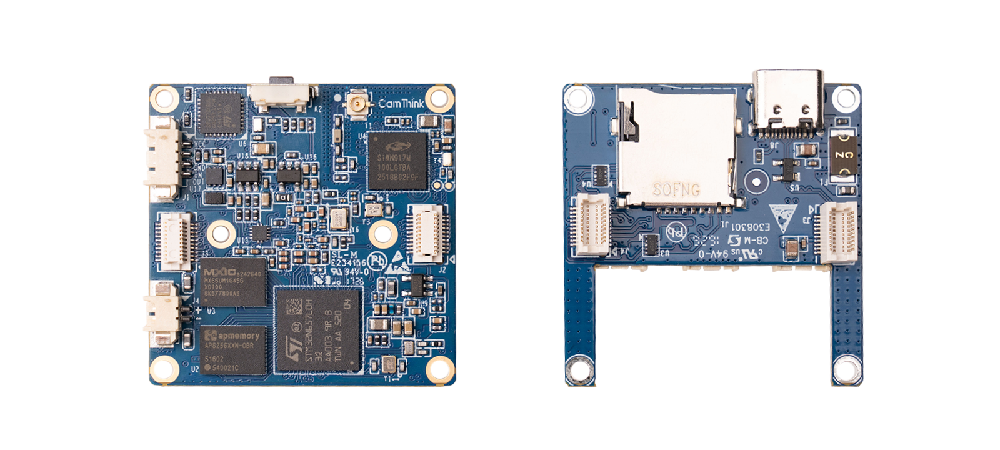
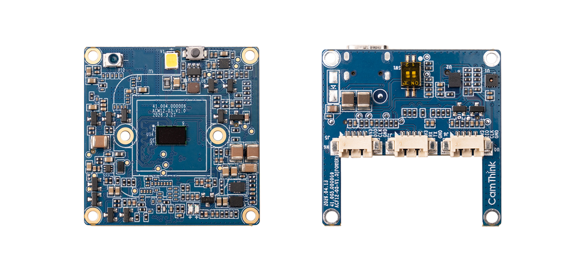
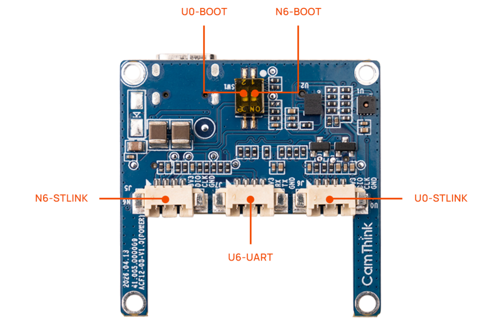

# NE302 — Mini AI Camera Board

[]()
[]()
[]()

> **38 × 38 mm AI camera module** built on the STM32N657 — ST's first MCU with a dedicated Neural Processing Unit (NPU). Real-time vision, always-on wake, and wireless connectivity in a compact, production-ready form factor.



---

## 📋 Contents

- [Hardware](#-hardware)
- [Software](#-software)
- [Build & Flash](#-build--flash)
- [Project Structure](#-project-structure)
- [Resources](#-resources)
- [License](#-license)

---

## 🔧 Hardware

The NE302 is a **two-board solution** — a Main Board (8-layer, 38 × 38 mm) carrying all core processing, and an Interface Board (4-layer) that breaks out power, debug, and storage. The camera sensor is soldered directly on-board.



### Main Board

| Feature | Detail |
|---------|--------|
| **MCU** | STM32N657 — Cortex-M55 @ 800 MHz + NPU (600 GOPS) |
| **Co-Processor** | STM32U073 — Cortex-M0+ always-on wake controller |
| **Camera** | 4 MP CMOS sensor, soldered directly on-board |
| **Flash** | 512 Mbit Octal-SPI NOR Flash (other capacities available on request) |
| **PSRAM** | 256 Mbit Octal-SPI PSRAM |
| **Wireless** | Wi-Fi 6 (802.11b/g/n/ax, 2.4 GHz single-band) + Bluetooth LE 5.4 |

> Additional network interfaces supported in firmware (require corresponding hardware module): Ethernet (SPI), Cat.1 4G LTE, WiFi HaLow (802.11ah).

### Interface Board

| Feature | Detail |
|---------|--------|
| **Power** | USB Type-C (5 V) |
| **Debug** | N6-STLINK, U0-STLINK (dual SWD) |
| **Console** | U6-UART serial (baud 921600) |
| **Storage** | MicroSD (TF) card slot |
| **Boot Control** | N6-BOOT & U0-BOOT DIP switches |



| Label | Function |
|-------|----------|
| **N6-STLINK** | STM32N6 debug & flash (SWD) |
| **U0-STLINK** | STM32U0 debug & flash (SWD) |
| **U6-UART** | STM32N6 serial console |
| **N6-BOOT** | STM32N6 boot mode (ON = flash mode) |
| **U0-BOOT** | STM32U0 boot mode (ON = flash mode) |

> ⚠️ After flashing, return boot switches to **OFF** and power-cycle or press RESET to run.

### What's Included

| Item | Qty |
|------|-----|
| NE302 Main Board (camera integrated) | × 1 |
| Interface Board | × 1 |
| Device enclosure | × 1 |
| WiFi / BLE antenna | × 1 |
| USB-C cable | × 1 |
| 4-pin adapter cable (1.25 mm → 2.54 mm Dupont) | × 1 |
| Heavy-duty double-sided adhesive tape (back mount) | × 1 |

### Flash Partition Layout

| Partition | Address | Size | Content |
|-----------|---------|------|---------|
| FSBL | `0x70000000` | 512 KB | First Stage Bootloader |
| NVS | `0x70080000` | 64 KB | Non-volatile configuration |
| OTA Info | `0x70090000` | 8 KB | OTA status & metadata |
| App A | `0x70100000` | 4 MB | Main application (active) |
| App B | `0x70500000` | 4 MB | Main application (OTA fallback) |
| Model A | `0x70900000` | 8 MB | AI model bundle (active) |
| Model B | `0x71100000` | 8 MB | AI model bundle (OTA fallback) |
| Web | `0x71900000` | 1 MB | Web frontend SPA |
| WiFi FW | `0x71A00000` | 3 MB | WiFi firmware |
| LittleFS | `0x71D00000` | ~32 MB | User data & file system |

---

## 💻 Software

### Key Capabilities

- **Edge AI** — NPU-accelerated object detection & pose estimation, runtime model switching
- **Video Pipeline** — MIPI CSI-2 → ISP → H.264 / MJPEG hardware encoding, full-res snapshot
- **Web UI** — Preact + TypeScript SPA with real-time preview via WebSocket
- **Multi-Protocol** — HTTP REST API, WebSocket, MQTT, RTSP, RTMP
- **OTA Updates** — A/B partition, encrypted + signed delivery, Web UI / HTTP / MQTT trigger
- **Secure Boot** — TrustZone secure/non-secure partitioning, signed boot chain, anti-rollback
- **Low-Power** — STM32U073 always-on domain, multi-source wake-up (IO, RTC, PIR, button, remote)

### Development Toolchain

| Tool | Version | Required |
|------|---------|----------|
| ARM GCC (`arm-none-eabi`) | 13.3+ | ✅ |
| GNU Make | 3.81+ | ✅ |
| Python | 3.8+ | ✅ |
| Node.js + pnpm | 20+ / 9+ | ✅ |
| STM32CubeProgrammer CLI | 2.19.0+ | Flash only |
| STM32 SigningTool CLI | 2.19.0+ | Sign only |
| ST Edge AI Core (`stedgeai`) | 3.0+ | Model conversion only |

See [SETUP.md](SETUP.md) for detailed installation instructions.

---

## 🔨 Build & Flash

### Build Pipeline Overview

Three stages — **compile**, **sign**, and **package**. Not every component needs all three:

```
Source Code
    │
    ▼
  make [component]          ← Compile only → unsigned .bin (not flashable)
    │
    ▼
  make sign-[component]     ← Sign → _signed.bin
    │                              FSBL: signed .bin is flashable as-is
    │                              App:  signed .bin still needs packaging
    ▼
  make pkg-[component]      ← Package → _v*_pkg.bin (flashable / OTA-ready)
```

| Stage | FSBL | App | Web | Model | WakeCore |
|-------|------|-----|-----|-------|----------|
| **Compile** | `make fsbl` | `make app` | `make web` | `make model` | `make wakecore` |
| **Sign** | `make sign-fsbl` | `make sign-app` | — | — | — |
| **Package** | `make pkg-fsbl` | `make pkg-app` | `make pkg-web` | `make pkg-model` | — |
| **Flash** | `make flash-fsbl` | `make flash-app` | `make flash-web` | `make flash-model` | `make flash-wakecore` |

> - **FSBL**: signed `.bin` can be flashed directly. Packaging is only needed for OTA delivery.
> - **App**: must be signed **and** packaged before flashing. `make flash-app` depends on both.
> - **Web & Model**: no signing required, but must be packaged before flashing.
> - **WakeCore**: compiled and flashed directly via its own Makefile (STM32U0 side).

### Before Flashing

> ⚠️ **Always set the boot switch for the target MCU before powering on or resetting the board.**
>
> | Target | ST-Link Port | Boot Switch | Procedure |
> |--------|-------------|-------------|-----------|
> | **STM32N6** (FSBL / App / Web / Model) | N6-STLINK | **N6-BOOT → ON** | Set switch, power-cycle, flash, set switch OFF, power-cycle to run |
> | **STM32U0** (WakeCore) | U0-STLINK | **U0-BOOT → ON** | Set switch, power-cycle, flash, set switch OFF, power-cycle to run |

### Common Commands

Application code is shared across STEdgeAI toolchains. Select the NPU runtime at build time with `STEDGEAI_VARIANT` (default `4.0`). **Firmware and model packages must use the same variant** — the installed `stedgeai` CLI must match (`STEDGEAI_CORE_DIR`).

| `STEDGEAI_VARIANT` | Docker image | Toolchain | Model OTA version |
|--------------------|--------------|-----------|-------------------|
| `2.2` | `camthink/ne301-dev:v2.2` | STEdgeAI 2.2 | `2.x.x.x` |
| `3.0` | `camthink/ne301-dev:v3.0` | STEdgeAI 3.0 | `3.x.x.x` |
| `4.0` (default) | `camthink/ne301-dev:v4.0` | STEdgeAI 4.0 | `4.x.x.x` |

Model release version is `$(STEDGEAI_BIT).$(MODEL_VERSION_OVERRIDE)`. Edit `MODEL_VERSION_OVERRIDE` in `version.mk` (e.g. `0.1.0` → `4.0.1.0` when `STEDGEAI_VARIANT=4.0`).

```bash
# Build (default STEdgeAI 4.0)
make                        # Build all (FSBL + App + Web + Model)
make app                    # Build application only
make web                    # Build web frontend
make model                  # Build AI model
make pkg                    # package for flash or OTA
make version                # show versions (incl. STEdgeAI variant)
make help

# Other STEdgeAI variants
make all STEDGEAI_VARIANT=3.0
make model STEDGEAI_VARIANT=3.0   # requires matching stedgeai + STEDGEAI_CORE_DIR

# ── Build & Flash  ───────────────────────────────────────
make                  # Build all (unsigned, not flashable)
make flash            # Build, sign, package & flash all (N6)
make flash-wakecore   # Flash WakeCore (U0)

# ── Per-component ───────────────────────────────────────
make flash-fsbl       # FSBL (sign → flash)
make flash-app        # App (sign → pkg → flash)
make flash-web        # Web (pkg → flash)
make flash-model      # Model (pkg → flash)

# ── Package for OTA ─────────────────────────────────────
make pkg              # → build/ne302_*_v*_pkg.bin

# ── Erase ───────────────────────────────────────────────
make erase-nvs        # Wipe device config
make erase-ota        # Reset OTA state
make erase-all        # Erase all except FSBL

# ── Utilities ───────────────────────────────────────────
make clean            # Clean all build artifacts
make info             # Show build configuration
make help             # Show all available targets
```

---

## 🏗️ Project Structure

```
ne302/
├── Appli/                  # STM32N6 main application
├── FSBL/                   # First Stage Bootloader (TrustZone secure boot)
├── WakeCore/               # STM32U0 always-on wake controller firmware
├── Web/                    # Preact + TypeScript web frontend
├── Model/                  # AI model files & conversion scripts
├── Script/                 # Build, flash, packaging, and CI scripts
├── Docs/                   # Documentation & datasheets
├── Hardware/               # Board schematics, layout, BOM
├── Custom/                 # Third-party libraries (lwIP, mbedTLS, etc.)
├── Drivers/                # STM32N6xx HAL & LL drivers
├── Middlewares/            # ST software packages (Camera, USBX, FileX, etc.)
├── BSP/                    # Board Support Package
├── Gcc/                    # Linker scripts & GCC config
├── Secure_nsclib/          # TrustZone non-secure callable library
├── Makefile                # Top-level build orchestration
├── Dockerfile              # Reproducible Docker dev environment
├── SETUP.md                # Detailed environment setup guide
└── LICENSE
```

---

## 📚 Resources

- [**NE302 Wiki**](https://wiki.camthink.ai/docs/neoeyes-ne302-series/quick-start) — Full documentation & API reference
- [**Hardware**](Hardware/) — Board schematics, layout, and BOM
- [**camthink.ai**](https://www.camthink.ai/) — Product page & announcements

---

## 📄 License

**Dual-License** — Community Edition (free for non-commercial use) and Commercial Edition. See [LICENSE](./LICENSE) for full terms.

---

**Development Team:** CamThink AI Camera Team  
**Contact:** [zbing@camthink.ai](mailto:zbing@camthink.ai)
