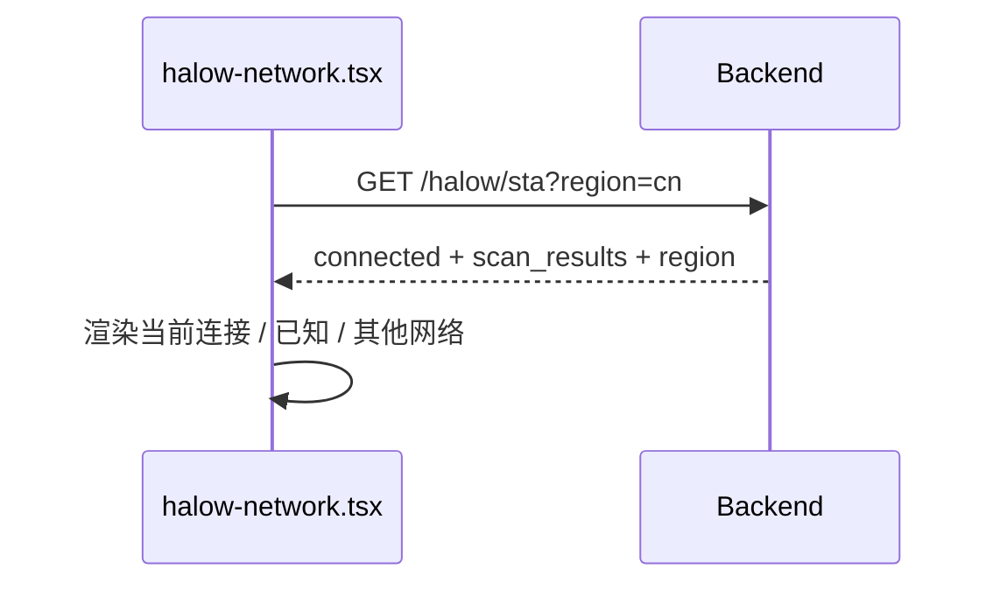
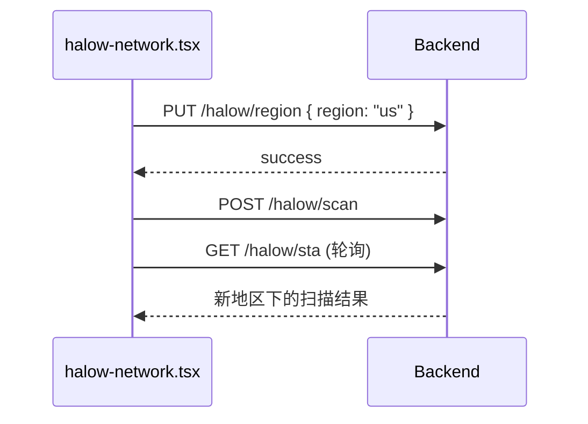
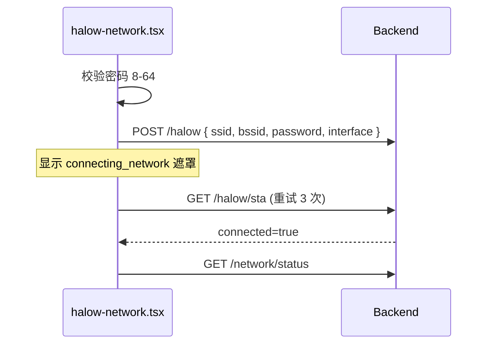

# Wi-Fi HaLow 网络配置 — 后端接口对接文档

> **前端页面**：`Web/src/pages/systemSettings/communication/halow-network.tsx`  
> **顶栏状态**：`Web/src/layout/pc/deviceInfo.tsx`（`active_type === 'halow'` 时展示）  
> **图标资源**：`Web/src/assets/icons/wifi-halow.svg`（`SvgIcon icon="wifi-halow"`）  
> **参考实现**：`wifi-network.tsx` + `Custom/Services/Web/api/api_network_module.c`（Wi-Fi STA 相关接口）  
> **当前状态**：配置页使用 Mock 数据；通讯切换 `halow` 暂未调用真实 `comm/switch`（见 `communication/index.tsx`）

---

## 1. 概述

### 1.1 页面功能与接口映射

| 前端操作 | 触发时机 | 建议接口 |
|---------|---------|---------|
| 进入页面 / 切换地区 | 挂载、`region` 变更 | `GET /halow/sta?region=xx` |
| 获取/保存地区配置 | 地区下拉变更（可合并到 STA） | `GET/PUT /halow/region` 或 STA 内嵌 `region` |
| 刷新扫描 | 点击刷新按钮 | `POST /halow/scan` → 轮询 `GET /halow/sta` |
| 连接网络 | 已知网直接连 / 未知网输密码 | `POST /halow` |
| 断开连接 | 当前连接「断开」 | `POST /halow/disconnect` |
| 忽略网络 | 已知网 / 当前连接「忽略」 | `POST /halow/delete` |
| 切换通讯方式为 HaLow | 通讯管理下拉 | `POST /comm/switch`（`type: "halow"`） |
| 顶栏通讯状态展示 | `GET /network/status` 轮询 / 进入页面 | `active_type === "halow"` 时显示 HaLow 图标 |

### 1.2 与 Wi-Fi 的差异

| 项目 | Wi-Fi (`wifi-network`) | Wi-Fi HaLow (`halow-network`) |
|------|------------------------|-------------------------------|
| 地区选择 | 无 | **有**（`us` / `eu` / `cn` / `jp` / `au`） |
| 接口路径前缀 | `/api/v1/system/network/wifi/*` | 建议 `/api/v1/system/network/halow/*` |
| `interface` 字段 | `"wl"`（STA） | 建议 `"halow"` 或硬件约定名 |
| 通讯类型枚举 | `wifi` | `halow`（需扩展 `communication_type_t`） |
| 顶栏图标 | `wifi`（`deviceInfo.tsx`） | `wifi-halow`（专用 SVG，与 Wi-Fi 区分） |

### 1.3 前端 UI 与图标约定

各入口对 `halow` 的展示方式（已实现）：

| 位置 | 文件 | 条件 | 图标 | 文案 / Tooltip |
|------|------|------|------|----------------|
| PC 顶栏设备信息 | `layout/pc/deviceInfo.tsx` | `communicationData.active_type === 'halow'` | `wifi-halow` | `sys.system_management.halow`（Wi-Fi HaLow） |
| 通讯配置页卡片 | `halow-network.tsx` | 当前已连接 | `wifi3` | 同左 i18n key |
| 信号强度 | `halow-network.tsx` | 列表 / 当前连接 | `wifi` / `wifi_middle` / `wifi_low` | 按 RSSI，与 Wi-Fi 页一致 |

**顶栏（`deviceInfo.tsx`）实现要点**：

```tsx
{communicationData?.active_type === 'halow' && (
  <Tooltip>
    <TooltipTrigger>
      <div className="w-5 h-5">
        <Link to="/system-settings">
          <SvgIcon icon="wifi-halow" />
        </Link>
      </div>
    </TooltipTrigger>
    <TooltipContent className="absolute">
      <p>{i18n._('sys.system_management.halow')}</p>
    </TooltipContent>
  </Tooltip>
)}
```

- 图标**不与**常规 Wi-Fi 顶栏共用 `wifi`，使用独立资源 `wifi-halow.svg`，避免两种无线模式在视觉上混淆。
- 点击跳转 `/system-settings`，与 `wifi` / `cellular` / `poe` 顶栏行为一致。
- 后端必须在 `GET /network/status` 的 `active_type`（及可选 `selected_type`）中返回 `"halow"`，顶栏才会显示该状态。

---

## 2. 通用约定

### 2.1 Base URL

```
/api/v1/system/network
```

### 2.2 认证

与现有系统接口一致：请求头携带 `Authorization`（登录 Token）。

### 2.3 统一响应格式

与现有 Web API 保持一致（`request.ts` 拦截器以 `success === true` 判断成功）：

```json
{
  "success": true,
  "data": { },
  "message": "操作成功描述"
}
```

失败示例：

```json
{
  "success": false,
  "error_code": "INVALID_REQUEST",
  "message": "错误描述"
}
```

前端通过 `res.data` 读取业务数据。

### 2.4 密码校验（前端已实现，后端需对齐）

| 规则 | 说明 |
|------|------|
| 长度 | 8–64 字符（未知网络连接时） |
| 字符集 | `a-zA-Z0-9!@#$%^&*()_+-=[]{}|;':",./<>?\`~` |
| 开放网络 | `security === "open"` 时可不传密码 |

### 2.5 `security` 枚举（与 Wi-Fi 一致）

| 值 | 含义 |
|----|------|
| `open` | 开放 |
| `wep` | WEP |
| `wpa` | WPA |
| `wpa2` | WPA2 |
| `wpa_wpa2_mixed` | WPA/WPA2 混合 |
| `wpa3` | WPA3 |

### 2.6 地区代码 `region`

前端固定枚举（`halow-network.tsx`）：

| value | 说明 |
|-------|------|
| `us` | 美国 |
| `eu` | 欧洲 |
| `cn` | 中国（默认） |
| `jp` | 日本 |
| `au` | 澳大利亚 |

后端需持久化当前地区；切换地区后应重新应用射频/信道规则并触发扫描。

---

## 3. 通讯总线接口扩展

### 3.1 通讯状态概览

**已有**：`GET /api/v1/system/network/status`

需在 `available_comm_types` 中增加 HaLow 条目（设备支持时）：

```json
{
  "type": "halow",
  "display_name": "Wi-Fi HaLow",
  "is_selected": false,
  "is_active": false,
  "is_connected": false,
  "is_current": false
}
```

`selected_type` / `active_type` / `current_comm_type` 在 HaLow 模式下返回 `"halow"`。

`current_comm_info` 建议在 `active_type === "halow"` 时增加 `ssid` 字段（与 Wi-Fi 行为一致）。

**顶栏联动（`deviceInfo.tsx`）**：

- 当 `data.active_type === "halow"` 时，PC 顶栏展示 `wifi-halow` 图标，Tooltip 为「Wi-Fi HaLow」。
- 与 `wifi` / `cellular` / `poe` 互斥，同一时间仅展示一种 `active_type` 对应图标。
- 建议在 `active_display_name` 或 `current_comm_display_name` 中返回可读的 `"Wi-Fi HaLow"`（可选，顶栏当前主要依赖 i18n）。

### 3.2 切换通讯方式

**已有**：`POST /api/v1/system/network/comm/switch`

**请求体**：

```json
{
  "type": "halow",
  "timeout_ms": 3000
}
```

**说明**：

- 当前后端 `communication_type_from_string` 仅支持 `wifi` / `cellular` / `poe`，需扩展 `halow`。
- 前端对接后应移除 `index.tsx` 中对 `halow` 的本地跳过逻辑。

**响应 `data`（参考现有 switch）**：

```json
{
  "success": true,
  "from_type": "wifi",
  "to_type": "halow",
  "switch_time_ms": 1200
}
```

---

## 4. HaLow 专用接口（建议新增）

路径前缀：`/api/v1/system/network/halow`

### 4.1 获取 STA 状态与扫描结果

```
GET /api/v1/system/network/halow/sta
```

**Query 参数（可选）**：

| 参数 | 类型 | 说明 |
|------|------|------|
| `region` | string | 若传入且与设备保存不一致，可先写地区再返回 STA |

**响应 `data`**（结构与 `GET /wifi/sta` 对齐，并增加地区字段）：

```json
{
  "connected": true,
  "ssid": "HaLow-Gateway-CN",
  "bssid": "00:11:22:33:44:03",
  "rssi": -48,
  "channel": 8,
  "ip_address": "192.168.10.100",
  "mac_address": "AA:BB:CC:DD:EE:FF",
  "state": "connected",
  "region": "cn",
  "supported_regions": ["us", "eu", "cn", "jp", "au"],
  "scan_results": {
    "known_networks": [
      {
        "ssid": "HaLow-Office-CN",
        "bssid": "00:11:22:33:44:10",
        "rssi": -58,
        "channel": 6,
        "security": "wpa2",
        "connected": false,
        "is_known": true,
        "last_connected_time": 1716000000
      }
    ],
    "known_count": 1,
    "unknown_networks": [
      {
        "ssid": "HaLow-Sensor-A-CN",
        "bssid": "00:11:22:33:44:20",
        "rssi": -65,
        "channel": 10,
        "security": "wpa2",
        "connected": false,
        "is_known": false,
        "last_connected_time": 0
      }
    ],
    "unknown_count": 1
  }
}
```

**前端使用方式**（对接后替换 Mock）：

```ts
// 当前连接：res.data.connected === true 时使用顶层 ssid/bssid/rssi
// 已知网络：res.data.scan_results.known_networks
// 其他网络：res.data.scan_results.unknown_networks
// 地区：res.data.region
```

**单条网络对象字段**：

| 字段 | 类型 | 必填 | 说明 |
|------|------|------|------|
| `ssid` | string | 是 | 1–31 字符 |
| `bssid` | string | 是 | `XX:XX:XX:XX:XX:XX` |
| `rssi` | number | 是 | dBm，如 -48 |
| `channel` | number | 否 | 信道号 |
| `security` | string | 是 | 见 2.5 |
| `connected` | boolean | 是 | 是否为当前连接 |
| `is_known` | boolean | 是 | 是否已保存 |
| `last_connected_time` | number | 否 | Unix 时间戳（秒） |

---

### 4.2 获取 / 设置地区

可与 4.1 合并；若独立维护：

#### 获取地区

```
GET /api/v1/system/network/halow/region
```

```json
{
  "region": "cn",
  "supported_regions": ["us", "eu", "cn", "jp", "au"]
}
```

#### 设置地区

```
PUT /api/v1/system/network/halow/region
```

**请求体**：

```json
{
  "region": "us"
}
```

**响应 `data`**：

```json
{
  "region": "us",
  "message": "Region updated, rescan recommended"
}
```

**业务要求**：

- 非法 `region` 返回 `INVALID_REQUEST`。
- 设置成功后建议自动触发后台扫描，或返回标志位 `scan_required: true` 供前端调用 scan。

---

### 4.3 触发扫描

```
POST /api/v1/system/network/halow/scan
```

**请求体**：空 `{}` 或可选 `{ "region": "cn" }`

**响应 `data`（异步，与 Wi-Fi 一致）**：

```json
{
  "status": "scan_started",
  "message": "HaLow scan started in background"
}
```

**前端轮询建议**（参考 `wifi-network.tsx` `reloadMask`）：

1. 调用 `scan`；
2. 等待约 3s；
3. 重试 `GET /halow/sta` 最多 3 次，间隔 3s；
4. 展示 `scanning_network` / `connecting_network` 遮罩文案。

---

### 4.4 连接网络

```
POST /api/v1/system/network/halow
```

**请求体**（对齐 `POST /wifi`）：

```json
{
  "interface": "halow",
  "ssid": "HaLow-Office-CN",
  "bssid": "00:11:22:33:44:10",
  "password": "12345678",
  "region": "cn"
}
```

| 字段 | 类型 | 必填 | 说明 |
|------|------|------|------|
| `interface` | string | 是 | 固定 `"halow"` |
| `ssid` | string | 是 | |
| `bssid` | string | 建议 | 同名 SSID 多 AP 时必填 |
| `password` | string | 条件 | 非 `open` 时必填 |
| `region` | string | 否 | 可与当前地区校验一致 |

**响应 `data`**：

```json
{
  "message": "HaLow connected successfully",
  "interface": "halow",
  "ssid": "HaLow-Office-CN",
  "bssid": "00:11:22:33:44:10"
}
```

**错误场景**：

| error_code | 场景 |
|------------|------|
| `INVALID_REQUEST` | 参数缺失、密码长度/格式不符 |
| `BUSINESS_ERROR_NETWORK_TIMEOUT` | 连接超时 |
| `SERVICE_UNAVAILABLE` | 通讯服务未运行 |

连接成功后前端会轮询 `GET /halow/sta` 刷新列表。

---

### 4.5 断开连接

```
POST /api/v1/system/network/halow/disconnect
```

**请求体**：

```json
{
  "interface": "halow"
}
```

**响应 `data`**：

```json
{
  "message": "HaLow disconnected successfully",
  "interface": "halow"
}
```

---

### 4.6 忽略（删除）已保存网络

```
POST /api/v1/system/network/halow/delete
```

**请求体**（对齐 `POST /wifi/delete`）：

```json
{
  "ssid": "HaLow-Office-CN",
  "bssid": "00:11:22:33:44:10"
}
```

**响应 `data`**：

```json
{
  "message": "HaLow network removed from known list",
  "ssid": "HaLow-Office-CN",
  "bssid": "00:11:22:33:44:10"
}
```

---

## 5. 前端对接清单

### 5.1 `systemSettings.ts` 建议新增

```ts
// 建议追加到 Web/src/services/api/systemSettings.ts

interface SetHalowReq {
  interface: 'halow';
  ssid: string;
  password: string;
  bssid: string;
  region?: string;
}

interface DeleteHalowReq {
  ssid: string;
  bssid: string;
}

// halow
getHalowSTAReq: (params?: { region?: string }) =>
  request.get('/api/v1/system/network/halow/sta', { params }),

getHalowRegionReq: () =>
  request.get('/api/v1/system/network/halow/region'),

setHalowRegionReq: (data: { region: string }) =>
  request.put('/api/v1/system/network/halow/region', data),

scanHalow: (data?: { region?: string }) =>
  request.post('/api/v1/system/network/halow/scan', data ?? {}),

setHalow: (data: SetHalowReq) =>
  request.post('/api/v1/system/network/halow', data),

deleteHalow: (data: DeleteHalowReq) =>
  request.post('/api/v1/system/network/halow/delete', data),

disconnectHalow: (data: { interface: 'halow' }) =>
  request.post('/api/v1/system/network/halow/disconnect', data),
```

### 5.2 `halow-network.tsx` 替换点

| 函数 | Mock 行为 | 对接后 |
|------|-----------|--------|
| `fetchMockHalowData` | `sleep` + 本地数据 | `getHalowSTAReq({ region })` |
| `handleRegionChange` | 仅 setState | `setHalowRegionReq` + 重新拉 STA |
| `handleScan` | `sleep` | `scanHalow` + `retryFetch(getHalowSTA)` |
| `handleConnect` | 本地改 state | `setHalow` + 轮询 STA |
| `handleDisconnect` | 本地改 state | `disconnectHalow` + `getHalowSTA` |
| `handleForget` | 本地 filter | `deleteHalow` + `getHalowSTA` |

### 5.3 `communication/index.tsx`

- 删除 `halow` 切换时跳过 `switchNetworkTypeReq` 的分支。
- `available_comm_types` 由后端返回决定是否展示 HaLow 选项（勿写死 `<SelectItem value="halow">`）。

### 5.4 刷新全局通讯状态

连接/断开成功后调用 `useCommunicationData().getCommunicationData()`（与 `wifi-network.tsx` 一致）。

连接/断开/切换地区后，顶栏 `deviceInfo.tsx` 会通过同一 store 的 `communicationData.active_type` 自动更新图标（无需单独接口）。

### 5.5 `layout/pc/deviceInfo.tsx`（已实现）

| 字段 | 要求 |
|------|------|
| 判断条件 | `communicationData?.active_type === 'halow'` |
| 图标 | `SvgIcon icon="wifi-halow"`（`assets/icons/wifi-halow.svg`） |
| Tooltip | `i18n._('sys.system_management.halow')` |
| 跳转 | `<Link to="/system-settings">` |

后端联调时重点确认：`active_type` 在 HaLow 已连接或已选为当前活跃链路时为 `"halow"`，而非 `"wifi"`。

---

## 6. 交互时序

### 6.1 页面加载



### 6.2 切换地区



### 6.3 连接未知网络



---

## 7. 后端实现参考（C 服务层）

建议在 `api_network_module.c` 中按 Wi-Fi 模式注册路由：

| Method | Path | Handler 建议命名 |
|--------|------|------------------|
| GET | `/system/network/halow/sta` | `network_halow_sta_handler` |
| GET | `/system/network/halow/region` | `network_halow_region_get_handler` |
| PUT | `/system/network/halow/region` | `network_halow_region_set_handler` |
| POST | `/system/network/halow/scan` | `network_halow_scan_handler` |
| POST | `/system/network/halow` | `network_halow_connect_handler` |
| POST | `/system/network/halow/disconnect` | `network_halow_disconnect_handler` |
| POST | `/system/network/halow/delete` | `network_halow_delete_handler` |

`communication_service` 需扩展：

- `COMM_TYPE_HALOW` / `communication_type_to_string("halow")`
- `communication_is_type_available(COMM_TYPE_HALOW)`
- HaLow 网口名（如 `NETIF_NAME_HALOW`）及扫描/连接实现

---

## 8. 联调检查表

- [ ] `GET /network/status` 返回 `halow` 类型且 `available_comm_types` 含 HaLow
- [ ] `active_type === "halow"` 时 PC 顶栏显示 `wifi-halow` 图标，Tooltip 为 Wi-Fi HaLow
- [ ] `POST /comm/switch { "type": "halow" }` 可成功切换
- [ ] `GET /halow/sta` 字段与本文档一致，前端无需改类型定义
- [ ] `PUT /halow/region` 切换后扫描结果随地区变化
- [ ] `POST /halow/scan` 异步完成后 STA 列表更新
- [ ] 连接/断开/忽略后 `known_networks` / `unknown_networks` 分类正确
- [ ] 密码错误、超时、服务未启动等错误码前端可 toast（`errors.business.*`）
- [ ] 前端移除 Mock 与 `halow` 切换特殊分支

---

## 9. 版本记录

| 版本 | 日期 | 说明 |
|------|------|------|
| v0.1 | 2026-05-29 | 初稿：基于 `halow-network.tsx` Mock 页与现有 Wi-Fi API 规范整理 |
| v0.2 | 2026-05-29 | 补充 `deviceInfo.tsx` 顶栏：`active_type=halow` + 图标 `wifi-halow` |
